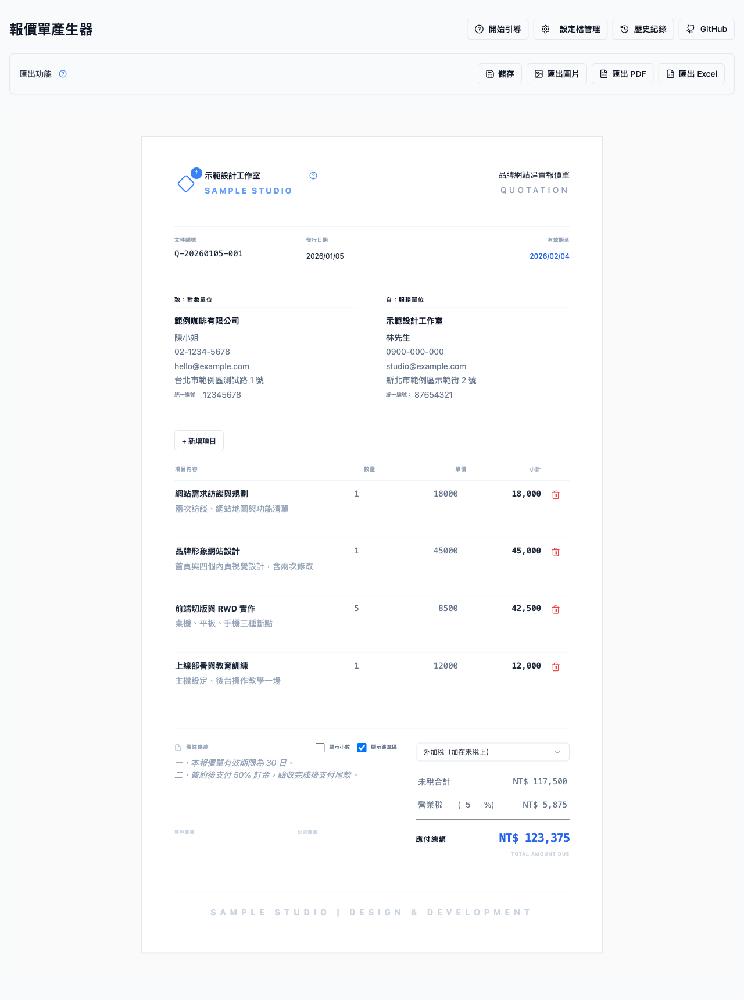
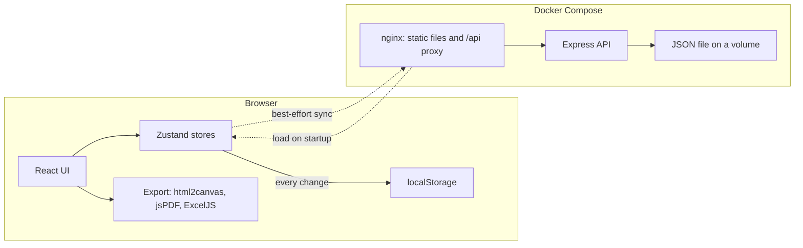

# Quote Generator

English | [繁體中文](./README.zh-TW.md)

A self-hosted quotation tool for freelancers and small businesses in Taiwan. You fill in the quote directly on an A4-shaped page, the tax is calculated the way Taiwanese invoices expect, and the result exports to PDF, PNG or Excel.



*All data in the screenshot is fictional.*

## Why I built this

Writing a quotation is a small job that comes back again and again: copy the last spreadsheet, change the client, fix the dates, re-check the tax by hand, export, notice the layout broke, fix it again. None of it is hard, and all of it is easy to get slightly wrong.

I have a habit of turning chores like that into small tools, so I built the thing I wanted: one page that looks like the final document, remembers my usual details, and gets the tax right. I use it myself when I need to send a quote.

It is deliberately a small tool. The interesting parts are not its size, but the two places where "simple" took some thought: the tax rules, and keeping data safe without making a server a hard requirement.

## What it does

The features follow the order in which a quote actually gets written.

**Fill in**
- Edit the quotation in place, on a fixed-width A4 layout, so what you see is what gets exported.
- Client and provider blocks with company name, contact, phone, email, address and tax ID; logo and company stamp upload (capped at 2 MB).
- Line items with drag-and-drop reordering; subtotals are derived from quantity and unit price.
- Document numbers are generated per day with a running sequence, and can be overwritten.

**Calculate**
- Three tax modes: tax added on top, tax already included, or no tax.
- Tax name and rate are editable; amounts display as rounded integers with thousands separators, with a switch for two decimals.

**Reuse**
- A config manager stores several options per field (for example, more than one provider identity or a few standard payment terms) and offers them next to each input. Configs can be exported and imported as JSON.
- The five most recent quotations are kept in a history drawer and can be reloaded or deleted.

**Export**
- PDF with multi-page support, PNG image, and Excel.
- A first-run guided tour and inline help explain the screen.

## Highlight 1: tax logic that matches local practice

In Taiwan, business tax on a quotation or invoice is a whole number of dollars. That sounds trivial until the price is quoted tax-included, because then the untaxed amount has to be derived, and the order of rounding decides whether the three numbers on the page still add up.

The rule implemented in [`src/utils/calculations.ts`](./src/utils/calculations.ts):

| Mode | Tax | Untaxed amount | Total |
|---|---|---|---|
| Added on top | `round(sum × rate)` | `sum` | `sum + tax` |
| Included | `round(sum × rate / (100 + rate))` | `sum − tax` | `sum` |
| None | `0` | `sum` | `sum` |

For a tax-included price of 10,000 at 5%: tax is `round(476.19) = 476`, so the untaxed amount is 9,524 and the total stays exactly 10,000. Rounding the tax first and deriving the untaxed amount by subtraction guarantees `untaxed + tax = total` for any rate, by construction; rounding the two figures independently gives no such guarantee.

Around that core there are a few guard rails: quantity and unit price cannot go negative, the tax rate is clamped to 0–100, and tax IDs accept digits only, up to the 8 characters a Taiwanese tax ID has.

## Highlight 2: offline-first persistence

The tool has to work when there is no server at all, and it should not lose work if a server exists but is unreachable. So the browser is the primary store and the API is an optional second copy.

- Every change is written to `localStorage` through Zustand's persist middleware. This alone is enough to run the app, and it is how `npm run dev` works with no backend.
- The same change is also sent to the API. If that request fails, the failure is swallowed on purpose: the local copy is already saved, and an error dialog would only interrupt the person writing the quote.
- On load, the app asks the server for data. If the server has a newer quotation, or has history while the browser has none, the server copy is adopted. This is what lets a second device pick up where the first one left off.
- The backend is intentionally tiny: an Express app with three endpoints that reads and writes a single JSON file on a Docker volume.

## Architecture



Solid lines are always available. Dotted lines are optional: if they fail, the app keeps working from `localStorage`. Exports run entirely in the browser and never touch the server.

## Technical decisions

**A JSON file instead of a database.**
The data is one person's quotations and one config object. A file on a volume is easy to back up, easy to inspect, and removes a whole service from the deployment. The cost is that it does not scale past a single user, and it was never meant to.

**The browser is the primary store; the server is a mirror.**
This keeps the tool usable with no backend and makes server downtime a non-event. The cost is that there are two copies of the truth, and the reconciliation rule on load is simple rather than rigorous.

**Whole-state `PUT`, no merge.**
Each sync sends the full quotation state and overwrites the file. With one user, last-write-wins is acceptable and keeps both sides small. Two devices editing at the same moment would overwrite each other; I chose not to solve a problem I do not have.

**Round the tax first, derive the rest by subtraction.**
Covered above. Rounding each figure on its own looks equivalent, but nothing forces the parts to add up to the total, and a one-dollar mismatch is exactly the kind of error a client notices.

**Render the page to a canvas for PDF, and choose page breaks deliberately.**
html2canvas plus jsPDF reuses the on-screen layout, so there is only one template to maintain. The naive version slices the canvas at fixed heights and cuts table rows in half, so the exporter collects the vertical ranges that must stay intact (rows, table header, marked blocks) and moves each cut up to the nearest safe boundary. The cost is that PDF text is an image, not selectable text; Excel export exists for anyone who needs the numbers.

**No authentication on the API.**
The intended deployment is a home network or a private VPN. Adding auth would mean accounts, sessions and password handling for a single-user tool. The cost is real and stated plainly: this API must not be exposed to the public internet as it is. See the [deployment note](./docs/DEVELOPMENT.md#security-note).

## How it was built

I built this with AI coding assistants (Cursor, and later Claude Code), and I think the division of labour is worth being specific about.

What I decided: what the tool should and should not do, the tax rules and their rounding order, the offline-first model and its trade-offs, the choice to keep the backend as a single file, and what counts as "done" for each change.

What the AI did: most of the implementation, inside written constraints. Early in the project those constraints lived in a development guide checked into the repository, covering things like typography rules that keep text from being clipped in exports; debugging sessions started from a written plan that compared the broken behaviour against the last working version before any code changed. Both are visible in the git history.

How I kept it honest: a Playwright suite runs against the real app, and I checked exported files by eye, because a PDF that is technically generated and visually broken passes most automated checks. Some of the export fixes in the history exist because that manual check failed.

## Engineering practices

- **End-to-end tests.** A Playwright suite organised into 11 areas: load and hydration, header fields, client and provider info, line items, tax and summary, saving, history, API persistence, config manager, export buttons, and edge cases.
- **Validation at the input boundary.** Length limits on every field, numeric clamps, digit-only tax IDs, upload size limits, sanitised download filenames, and a guard against double-clicking export.
- **Typed throughout.** TypeScript with `strict` enabled, plus ESLint.
- **Reproducible deployment.** A multi-stage Docker build serves the static bundle from nginx; Compose wires it to the API and a named volume.
- **Readable history.** Conventional commits, and dead code is removed rather than left behind.

There are no unit tests yet. The calculation module is pure and would be the obvious first candidate.

## Status

In personal use. It does what I need, so changes now are mostly fixes to export fidelity and validation. It is a single-user tool by design: no accounts, no conflict resolution, and no authentication on the API.

## Quick start

```bash
npm install
npm run dev
```

That is enough to use the app; data stays in the browser. For the API, Docker Compose, and running the tests, see [docs/DEVELOPMENT.md](./docs/DEVELOPMENT.md).

**Stack:** React 19, TypeScript, Vite, Zustand, Tailwind CSS with shadcn/ui, dnd-kit, html2canvas, jsPDF, ExcelJS, Express, nginx, Docker Compose, Playwright.

## Author

Built by [Bighsueh](https://github.com/Bighsueh).

## License

[MIT](./LICENSE)
