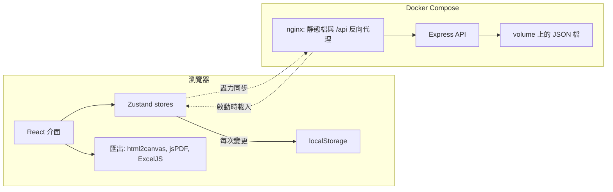

# 報價單產生器

[English](./README.md) | 繁體中文

給台灣接案者與小公司用的自架報價單工具。直接在 A4 版面上填寫，稅額照台灣開立單據的習慣計算，填完可匯出 PDF、PNG 或 Excel。


*截圖中的資料皆為虛構。*

## 為什麼做這個

開報價單是件不難、但會一再回來的小事：複製上一份試算表、改客戶、改日期、手動再驗一次稅額、匯出、發現版面跑掉、再修一次。每一步都不難，也每一步都很容易錯一點點。

我習慣把這類反覆出現的雜事做成小工具，所以就做了自己想要的那一個：畫面長得就是最後的文件、記得我常用的資料、稅額算得對。現在我自己需要開報價單時就是用它。

它刻意維持是個小工具。值得一提的不是規模，而是兩個「看起來簡單、其實要想一下」的地方：稅額規則，以及在不強制需要伺服器的前提下把資料保住。

## 功能

功能照實際開一張報價單的順序排列。

**填寫**
- 直接在固定寬度的 A4 版面上編輯，畫面上看到的就是匯出的樣子。
- 客戶與服務方區塊：公司名稱、聯絡人、電話、Email、地址、統一編號；可上傳 Logo 與公司章（上限 2 MB）。
- 報價項目可拖曳排序，小計由數量與單價推導。
- 文件編號依日期產生當日流水號，也可以自行改寫。

**計稅**
- 三種稅制：外加、內含、不計稅。
- 稅目名稱與稅率可調；金額預設四捨五入為整數並加千分位，可切換顯示兩位小數。

**重複利用**
- 設定檔管理可替每個欄位存多個選項（例如不只一個服務方身分、幾套常用的付款條款），填寫時在欄位旁直接選用。設定檔可匯出、匯入為 JSON。
- 歷史紀錄保留最近五筆報價單，可重新載入或刪除。

**匯出**
- 支援多頁的 PDF、PNG 圖片與 Excel。
- 首次使用有導覽，畫面上也有說明提示。

## 亮點一：符合在地實務的稅額邏輯

在台灣，報價單或發票上的營業稅是整數。這聽起來沒什麼，直到報的是含稅價：這時未稅金額必須反推，而四捨五入的先後順序，會決定單據上那三個數字最後加不加得起來。

[`src/utils/calculations.ts`](./src/utils/calculations.ts) 實作的規則：

| 模式 | 稅額 | 未稅金額 | 總額 |
|---|---|---|---|
| 外加 | `round(小計 × 稅率)` | `小計` | `小計 + 稅額` |
| 內含 | `round(小計 × 稅率 / (100 + 稅率))` | `小計 − 稅額` | `小計` |
| 不計稅 | `0` | `小計` | `小計` |

以含稅價 10,000、稅率 5% 為例：稅額是 `round(476.19) = 476`，未稅金額因此是 9,524，總額維持剛好 10,000。先把稅額四捨五入、再用減法得出未稅金額，在任何稅率下都必然滿足「未稅 + 稅額 = 總額」；兩個數字各自四捨五入則沒有這個保證。

核心規則之外還有幾道防線：數量與單價不能是負數、稅率限制在 0–100、統一編號只接受數字且最多 8 碼。

## 亮點二：離線優先的資料保存

這個工具必須在完全沒有伺服器時也能用；有伺服器但連不上時，也不該弄丟資料。所以瀏覽器是主要儲存處，API 是選配的第二份副本。

- 每次變更都透過 Zustand 的 persist middleware 寫進 `localStorage`。光這樣就足以運作，`npm run dev` 不啟動後端時就是這個模式。
- 同一筆變更也會送往 API。請求失敗時會刻意不報錯：本機那份已經存好了，跳出錯誤視窗只會打斷正在填報價單的人。
- 載入時會向伺服器要資料。伺服器上的報價單比較新，或伺服器有歷史紀錄而瀏覽器沒有時，就採用伺服器那份。換一台裝置能接著做，靠的就是這一步。
- 後端刻意做得很小：一支 Express 程式、三個端點，讀寫 Docker volume 上的單一 JSON 檔。

## 架構



實線是永遠可用的路徑；虛線是選配的，失敗時應用程式照樣靠 `localStorage` 運作。匯出完全在瀏覽器內完成，不經過伺服器。

## 技術決策

**用 JSON 檔，不用資料庫。**
資料就是一個人的報價單加一份設定檔。放在 volume 上的檔案好備份、好檢查，部署也少一個服務。代價是它撐不了多人使用，而這本來就不是目標。

**瀏覽器是主要儲存處，伺服器是鏡像。**
這讓工具沒有後端也能用，伺服器掛掉也不算事件。代價是事實有兩份，而載入時的對帳規則求的是簡單，不是嚴謹。

**整包狀態 `PUT` 覆寫，不做合併。**
每次同步都送出完整的報價單狀態並覆寫檔案。只有一個使用者時，後寫者勝是可以接受的，前後端也都能保持很小。兩台裝置同時編輯會互相覆蓋；我選擇不去解一個自己沒有的問題。

**稅額先四捨五入，其餘用減法推導。**
如上所述。各自四捨五入看起來等價，但沒有任何機制保證各部分加起來等於總額，而差一塊錢正是客戶會注意到的那種錯。

**PDF 用「把頁面畫成 canvas」的方式產生，並且刻意挑選分頁位置。**
html2canvas 加 jsPDF 可以直接沿用螢幕上的版面，只需要維護一份樣板。最直覺的做法是按固定高度切 canvas，結果會把表格的列切成兩半；所以匯出時會先收集不能被切開的垂直區間（表格列、表頭、標記過的區塊），再把每個切點往上移到最近的安全邊界。代價是 PDF 裡的文字是圖片、無法選取；需要數字的人可以用 Excel 匯出。

**API 沒有驗證。**
預期的部署環境是家用網路或私有 VPN。替單人工具加上驗證，代表要處理帳號、session 與密碼。這個代價是真實的，也在此明講：這支 API 以現況不可以直接暴露在公開網路上。請見[部署安全提醒](./docs/DEVELOPMENT.md#security-note)。

## 怎麼做出來的

這個專案是和 AI 程式助手（Cursor，後來是 Claude Code）一起做的，分工方式我認為值得講清楚。

我決定的事：工具該做什麼、不該做什麼；稅額規則與四捨五入順序；離線優先的模型與它的取捨；後端維持單一檔案的選擇；以及每一次修改怎樣才算「做完」。

AI 做的事：大部分的實作，而且是在寫下來的約束之內。專案早期，這些約束是一份放在 repo 裡的開發指南，內容包含避免文字在匯出時被裁切的排版規範；除錯時則先寫計畫，把壞掉的行為和最後一個正常的版本對照清楚，才開始改程式。這兩份文件都還在 git 歷史裡。

怎麼確保品質：Playwright 測試直接對真實的應用程式執行；匯出的檔案我會親眼檢查，因為一份「技術上成功產生、視覺上壞掉」的 PDF，可以通過大部分的自動化檢查。歷史中有些匯出相關的修正，就是因為這道人工檢查沒過。

## 工程實務

- **端對端測試。** Playwright 測試分成 11 個範圍：載入與資料還原、表頭欄位、客戶與服務方資訊、報價項目、稅額與摘要、儲存、歷史紀錄、API 持久化、設定檔管理、匯出按鈕、邊界案例。
- **在輸入邊界做驗證。** 所有欄位的長度上限、數值範圍限制、統編僅限數字、上傳大小上限、下載檔名過濾特殊字元、匯出中防止連點。
- **全面型別化。** TypeScript 開啟 `strict`，搭配 ESLint。
- **可重現的部署。** 多階段 Docker build，由 nginx 提供靜態檔；Compose 把它和 API、具名 volume 接起來。
- **看得懂的歷史。** 使用 conventional commits，不再使用的程式碼直接刪除而不是留著。

目前還沒有單元測試。計算模組是純函式，會是最適合先補的地方。

## 現況

自用中。它已經能滿足我的需求，現在的修改多半是匯出還原度與輸入驗證的修正。它在設計上就是單人工具：沒有帳號、不處理衝突、API 沒有驗證。

## 快速開始

```bash
npm install
npm run dev
```

這樣就能使用，資料存在瀏覽器裡。API、Docker Compose 與測試的執行方式請見 [docs/DEVELOPMENT.md](./docs/DEVELOPMENT.md)（英文）。

**技術棧：** React 19、TypeScript、Vite、Zustand、Tailwind CSS 搭配 shadcn/ui、dnd-kit、html2canvas、jsPDF、ExcelJS、Express、nginx、Docker Compose、Playwright。

## 作者

[Bighsueh](https://github.com/Bighsueh)

## 授權

[MIT](./LICENSE)
